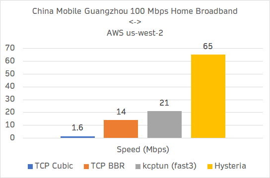

# 

[![License][1]][2] [![Release][3]][4] [![Telegram][5]][6] [![Discussions][7]][8]

[1]: https://img.shields.io/badge/license-MIT-blue

[2]: LICENSE.md

[3]: https://img.shields.io/github/v/release/apernet/hysteria?style=flat-square

[4]: https://github.com/apernet/hysteria/releases

[5]: https://img.shields.io/badge/chat-Telegram-blue?style=flat-square

[6]: https://t.me/hysteria_github

[7]: https://img.shields.io/github/discussions/apernet/hysteria?style=flat-square

[8]: https://github.com/apernet/hysteria/discussions

An [Aperture Internet Laboratory](https://apernet.io/) project

----------

Hysteria is a feature-packed proxy & relay tool optimized for lossy, unstable connections (e.g. satellite networks,
congested public Wi-Fi, connecting to foreign servers from China) powered by a customized protocol based on QUIC.

## Use cases

- Censorship circumvention
- Boosting slow connections
- Bypassing commercial/academic/corporate firewalls
- Bypassing ISP throttling
- ...

## Modes

- SOCKS5 proxy (TCP & UDP)
- HTTP/HTTPS proxy
- TCP/UDP relay
- TCP/UDP TPROXY (Linux)
- TCP REDIRECT (Linux)
- TUN (TAP on Windows)
- Still growing...

## **[Documentation](https://hysteria.network/)**

----------

Hysteria 是一个功能丰富的，专为恶劣网络环境（如卫星网络、拥挤的公共 Wi-Fi、从中国连接境外服务器等）进行优化的双边加速工具，基于修改版的 QUIC 协议。

## 常见用例

- 绕过网络审查
- 提升传输速度
- 绕过商业/学校/企业防火墙
- 绕过运营商 QoS 限速

## 模式

- SOCKS5 代理 (TCP & UDP)
- HTTP/HTTPS 代理
- TCP/UDP 转发
- TCP/UDP TPROXY 透明代理 (Linux)
- TCP REDIRECT 透明代理 (Linux)
- TUN (Windows 下为 TAP)
- 仍在增加中...

## **[中文文档](https://hysteria.network/zh/)**

----------

## Benchmarks

----------

**Donations are greatly appreciated!** Contact me if you would like your name listed as a sponsor.

**欢迎大佬捐赠！** 如希望挂名请在捐赠后联系我。

