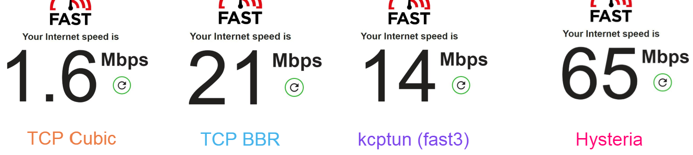

# 

[![License][1]][2] [![Release][3]][4] [![Telegram][5]][6]

[1]: https://img.shields.io/github/license/tobyxdd/hysteria?style=flat-square

[2]: LICENSE.md

[3]: https://img.shields.io/github/v/release/tobyxdd/hysteria?style=flat-square

[4]: https://github.com/tobyxdd/hysteria/releases

[5]: https://img.shields.io/badge/chat-Telegram-blue?style=flat-square

[6]: https://t.me/hysteria_github

Hysteria 是专门针对恶劣网络环境（常见于卫星网络、在中国连接国外服务器等）进行优化的 TCP 连接转发和代理工具（即所谓的双边加速），
基于修改版的 QUIC 协议。

可以理解为是我此前弃坑的项目 https://github.com/dragonite-network/dragonite-java 的续作。

## 快速入门

注意：本节提供的配置只是为了快速上手，可能无法满足你的需求。请到 [高级用法](#高级用法) 中查看所有可用选项及其含义。

### 服务器

在目录下建立一个 `config.json`

```json
{
  "listen": ":36712",
  "cert": "/home/ubuntu/my_cert.crt",
  "key": "/home/ubuntu/my_key.crt",
  "obfs": "AMOGUS",
  "up_mbps": 100,
  "down_mbps": 100
}
```

服务端必须要一个 TLS 证书（但并非一定要受信 CA 签发的）。

`obfs` 选项使用提供的密码对协议进行混淆，这样协议就不容易被检测出是 Hysteria/QUIC，可以用来绕过针对性的 DPI 屏蔽或者 QoS。
如果服务端和客户端的密码不匹配就不能建立连接，因此这也可以作为一个简单的密码验证。对于更高级的验证方案请见下文 `auth`。

`up_mbps` 和 `down_mbps` 限制服务器对每个客户端的最大上传和下载速度。这些也是可选的，如果不需要可以移除。

要启动服务端，只需运行

```
./cmd_linux_amd64 server
```

如果你的配置文件没有命名为 `config.json` 或在别的路径，请用 `-config` 指定路径：

```
./cmd_linux_amd64 -config blah.json server
```

### 客户端

和服务器端一样，在程序根目录下建立一个`config.json`。

```json
{
  "server": "example.com:36712",
  "obfs": "AMOGUS",
  "up_mbps": 10,
  "down_mbps": 50,
  "socks5": {
    "listen": "127.0.0.1:1080"
  },
  "http": {
    "listen": "127.0.0.1:8080"
  },
  "relay": {
    "listen": "127.0.0.1:2222",
    "remote": "123.123.123.123:22"
  }
}
```

这个配置同时开了 SOCK5 (支持 TCP & UDP) 代理，HTTP 代理和到 `123.123.123.123:22` 的 TCP 转发。请根据自己实际需要修改和删减。

如果你的服务端证书不是由受信任的 CA 签发的，需要用 `"ca": "/path/to/file.ca"` 指定使用的 CA 或者用 `"insecure": true` 忽略所有
证书错误（不推荐）。

`up_mbps` 和 `down_mbps` 在客户端是必填选项，请根据实际网络情况尽量准确地填写，否则将影响 Hysteria 的使用体验。

有些用户可能会尝试用这个功能转发其他加密代理协议，比如 Shadowsocks。这样虽然可行，但从性能的角度不推荐 - Hysteria 本身就用 TLS，
转发的代理协议也是加密的，再加上如今几乎所有网站都是 HTTPS 了，等于做了三重加密。如果需要代理就用我们的代理模式。

## 对比

代理客户端：广州移动宽带 100M

代理服务端：AWS 美西 Oregon (us-west-2) (最差线路之一)



## 高级用法

### 服务器

```json5
{
  "listen": ":36712", // 监听地址
  "cert": "/home/ubuntu/my_cert.crt", // 证书
  "key": "/home/ubuntu/my_key.crt", // 证书密钥
  "up_mbps": 100, // 单客户端最大上传速度
  "down_mbps": 100, // 单客户端最大下载速度
  "disable_udp": false, // 禁用 UDP 支持
  "acl": "my_list.acl", // 见下文 ACL
  "obfs": "AMOGUS", // 混淆密码
  "auth": { // 验证
    "mode": "password", // 验证模式，暂时只支持 "password" 与 "none"
    "config": {
      "password": "yubiyubi"
    }
  },
  "recv_window_conn": 33554432, // QUIC stream receive window
  "recv_window_client": 67108864, // QUIC connection receive window
  "max_conn_client": 4096 // 单客户端最大活跃连接数
}
```

#### 接入外部验证

如果你是商业代理服务提供商，可以这样把 Hysteria 接入到自己的验证后端：

```json5
{
  // ...
  "auth": {
    "mode": "external",
    "config": {
      "http": "https://api.example.com/auth" // 支持 HTTP 和 HTTPS
    }
  }
}
```

对于上述配置，Hysteria 会把验证请求通过 HTTP POST 发送到 `https://api.example.com/auth`

```json5
{
  "addr": "111.222.111.222:52731",
  "payload": "[BASE64]", // 对应客户端配置的 auth 或 auth_str 字段
  "send": 12500000, // 协商后的服务端最大发送速率 (Bps)
  "recv": 12500000 // 协商后的服务端最大接收速率 (Bps)
}
```

后端必须用 HTTP 200 状态码返回验证结果（即使验证不通过）：

```json5
{
  "ok": false,
  "msg": "No idea who you are"
}
```

#### Prometheus 流量统计

通过 `prometheus_listen` 选项可以让 Hysteria 暴露一个 Prometheus HTTP 客户端 endpoint 用来统计流量使用情况。
例如如果配置在 8080 端口，则 API 地址是 `http://example.com:8080/metrics`

```text
hysteria_traffic_downlink_bytes_total{auth="55m95auW5oCq"} 122639
hysteria_traffic_downlink_bytes_total{auth="aGFja2VyISE="} 3.225058e+06

hysteria_traffic_uplink_bytes_total{auth="55m95auW5oCq"} 40710
hysteria_traffic_uplink_bytes_total{auth="aGFja2VyISE="} 37452
```

`auth` 是客户端发来的验证密钥，经过 Base64 编码。

### 客户端

```json5
{
  "server": "example.com:36712", // 服务器地址
  "up_mbps": 10, // 最大上传速度
  "down_mbps": 50, // 最大下载速度
  "socks5": {
    "listen": "127.0.0.1:1080", // SOCKS5 监听地址
    "timeout": 300, // TCP 超时秒数
    "disable_udp": false, // 禁用 UDP 支持
    "user": "me", // SOCKS5 验证用户名
    "password": "lmaolmao" // SOCKS5 验证密码
  },
  "http": {
    "listen": "127.0.0.1:8080", // HTTP 监听地址
    "timeout": 300, // TCP 超时秒数
    "user": "me", // HTTP 验证用户名
    "password": "lmaolmao", // HTTP 验证密码
    "cert": "/home/ubuntu/my_cert.crt", // 证书 (变为 HTTPS 代理)
    "key": "/home/ubuntu/my_key.crt" // 证书密钥 (变为 HTTPS 代理)
  },
  "relay": {
    "listen": "127.0.0.1:2222", // 转发监听地址
    "remote": "123.123.123.123:22", // 转发目标地址
    "timeout": 300 // TCP 超时秒数
  },
  "acl": "my_list.acl", // 见下文 ACL
  "obfs": "AMOGUS", // 混淆密码
  "auth": "[BASE64]", // Base64 验证密钥
  "auth_str": "yubiyubi", // 字符串验证密钥，和上面的选项二选一
  "insecure": false, // 忽略一切证书错误 
  "ca": "my.ca", // 自定义 CA
  "recv_window_conn": 33554432, // QUIC stream receive window
  "recv_window": 67108864 // QUIC connection receive window
}
```

## 关于 ACL

[ACL 文件格式](ACL.zh.md)

## 日志

程序默认在 stdout 输出 DEBUG 级别，文字格式的日志。

如果需要修改日志级别可以使用 `LOGGING_LEVEL` 环境变量，支持 `panic`, `fatal`, `error`, `warn`, `info`, `debug`, `trace`

如果需要输出 JSON 可以把 `LOGGING_FORMATTER` 设置为 `json`

如果需要修改日志时间戳格式可以使用 `LOGGING_TIMESTAMP_FORMAT`